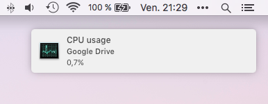

CPU watch
=========

A little script to help you watch processes eating to much CPU on OSX.



Dependency : `brew install terminal-notifier`

# One shot run
```
./cpu_watch.sh 50 "Google Drive" 10
```
This will pop a notification up if the process Google Drive is taking 50% of
a CPU or more. Click on the notification and it will open Acitivity Monitor.
But it's not very convenient to run this manually. See below :

# Start the script every X sec
You can use a LaunchAgent to launch the bash script every X sec.

Here's an example where `cpu_watch.sh` is fired every 30 sec.
```xml
<?xml version="1.0" encoding="UTF-8"?>
<!DOCTYPE plist PUBLIC "-//Apple//DTD PLIST 1.0//EN" "http://www.apple.com/DTDs/PropertyList-1.0.dtd">
<plist version="1.0">
<dict>
    <key>Label</key>
    <string>com.wuip.cpu_watch</string>

    <key>ProgramArguments</key>
    <array>
        <string>/path/to/cpu_watch/cpu_watch.sh</string>
        <string>50</string>
        <string>Google Drive|Dropbox</string>
        <string>10</string>
    </array>

    <key>StartInterval</key>
    <integer>30</integer>

    <key>RunAtLoad</key>
    <true />

</dict>
</plist>
```
Name this file `com.wuip.cpu_watch`,
put it into ~/Library/LaunchAgents and
`launchctl load ~/Library/LaunchAgents/com.wuip.cpu_watch.plist`.
It will start when the user get logged in.
Don't forget to make the script executable `chmod +x cpu_watch.sh`

# Arguments
```
./cpu_watch.sh <cpu percent> <regex> <check interval> <path to terminal-notifier>
```

- `<cpu percent>` : integer between 0 and 100.
- `<regex>` : a regex that will be use this way : `ps -erco %cpu,command | grep -E "<regex>"`
- `<check interval>` : min time in minutes between two notification about the same process
- `<path to terminal-notififier>` : when not set default is `/usr/local/Cellar/terminal-notifier/1.6.3/bin/terminal-notifier`

# [LICENSE](LICENSE) : wtfpl
